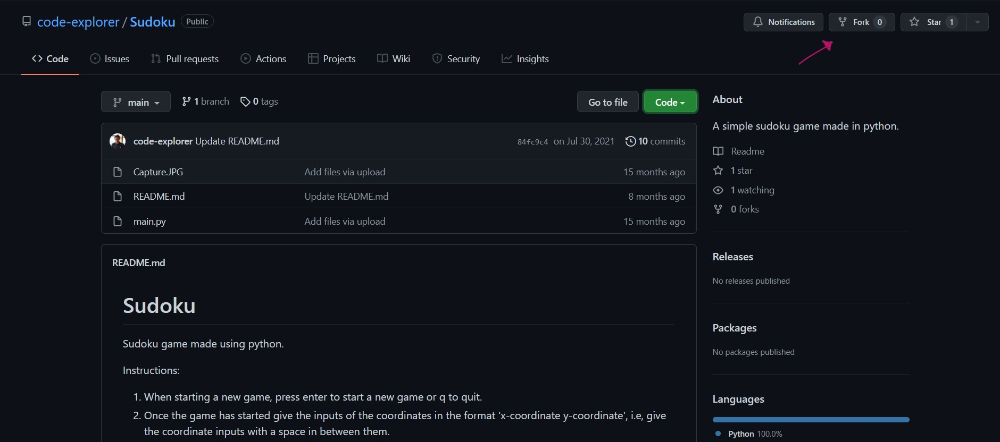

Let us loot at how you can edit a repository already on github.

First, to edit any repository you need to be its owner. If these is an open source repository on github that you want to edit. You can use the clone option to make the copy of that repository with you as its owner. Let us try doing this with a repository.

Head to this sample repository on github: [Sample Repository - Sudoku](https://github.com/code-explorer/Sudoku)

Make sure you are logged and fork the repository by hitting the fork button in the top right.


Now the repository should be visible on your account. Go to your repository and copy the url link of the repository.

Now you can bring this repository to your local environment using the `git clone` command.

First, open up your terminal and go to the folder where you want to put the repository.

Then type in the following command:

```console
git clone <repository url>
```

Wait for a few seconds for the repository to be downloaded. Now you can edit and push changes to the forked repository.
