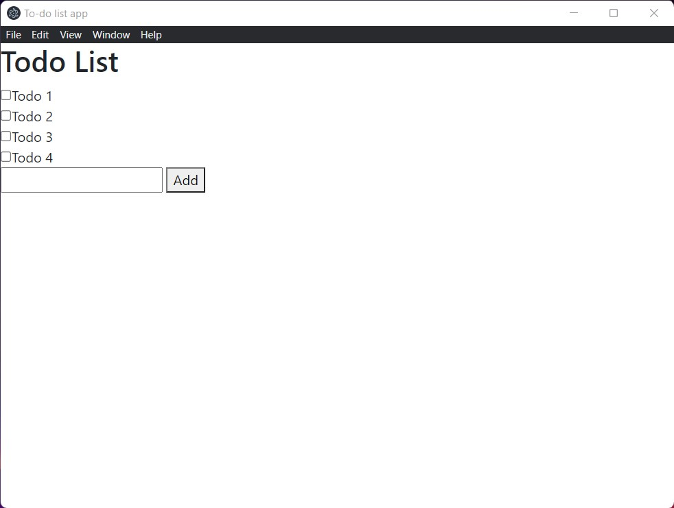
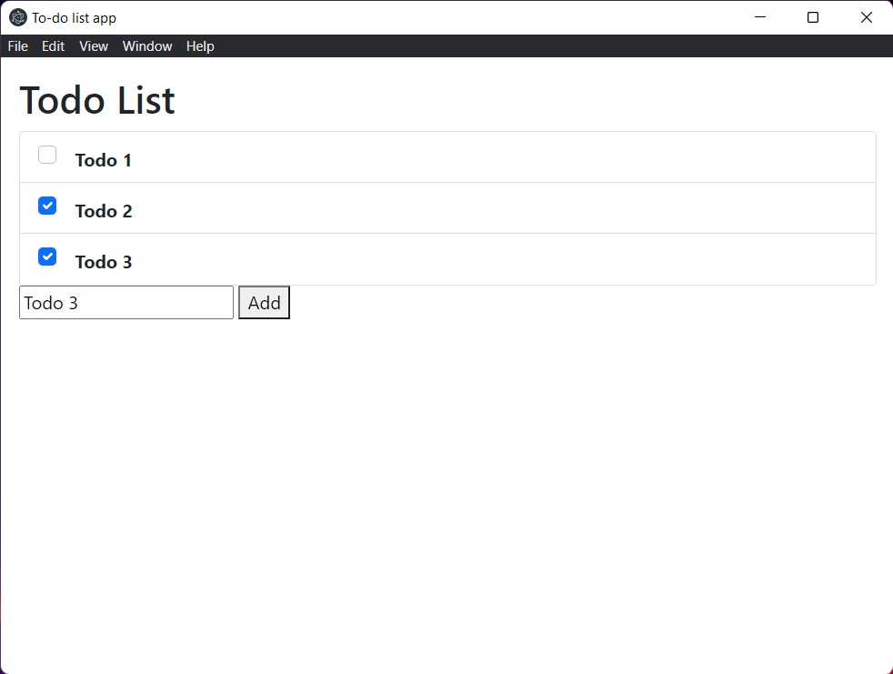

As a final step to our project let use the bootstrap css library to make our app look appealing. If you don't really know what bootstrap is, it is a css library which allows you to quickly create beautiful websites. You can read more about it [here](https://getbootstrap.com/).

## Installing the bootstrap library
First, let us install the bootstrap library. Run the following command to install the bootstrap library:
```
npm install bootstrap --save
```

## Linking bootstrap to index.html
To use bootstrap in your html file you need to link it by adding the following line of code inside the head of the html:
```html
<link rel="stylesheet" href="node_modules\bootstrap\dist\css\bootstrap.min.css">
```

## Adding bootstrap to index.html
At this point, if you run your app, it should look something like this:


Let us improve it by first adding some padding. Modify the body tag of your html file by adding the class `p-3` to it. Now the html's body should look like this:
```html
<body class="p-3">
  ...
</body>
```

Next up, add the class `list-group` to your todos div element so that it looks like this:
```html
<div class="list-group" id="todos"></div>
```

At this point your `index.html` should look like this:

```html
<!DOCTYPE html>
<html>
  <head>
    <meta charset="UTF-8">
    <!-- https://developer.mozilla.org/en-US/docs/Web/HTTP/CSP -->
    <meta http-equiv="Content-Security-Policy" content="default-src 'self'; script-src 'self'; img-src 'self' blob: data:;">
    <meta http-equiv="X-Content-Security-Policy" content="default-src 'self'; script-src 'self'; img-src 'self' blob: data:;">

    <link rel="stylesheet" href="node_modules\bootstrap\dist\css\bootstrap.min.css">

    <title>To-do list app</title>
  </head>
  <body class="p-3">
    <h1>Todo List</h1>
    <div class="list-group" id="todos"></div>

    <input id="add-inp" type="text" />
    <button id="add-btn">Add</button>

    <script src="index.js"></script>
  </body>
</html>
```

## Adding bootstrap to todos
Next let us add bootstrap to the todos that we add. Let us change our `displayTodos()` function like so:
```javascript
function displayTodos(todos) {
  // Get the div inside which we are going to store the todos
  todosHTML = document.getElementById("todos");

  // Clear the contents of the div
  todosHTML.innerHTML = "";

  let i = 0;
  todos.forEach((todo) => {
    todosHTML.innerHTML +=
      '<label class="list-group-item d-flex gap-3 todo-checkbox"><input class="form-check-input flex-shrink-0" type="checkbox" id="todo-check-' +
      i +
      '"' +
      (todo.Done ? "checked" : "") +
      '><span class="pt-1 form-checked-content"><strong>' +
      todo.Description +
      "</strong></span></label>";
    i++;
  });

  ipcRenderer.send("updated-todos", Todos);

  for (let i = 0; i < Todos.length; i++) {
    document
      .getElementById("todo-check-" + i)
      .addEventListener("change", () => toggleTodo(i));
  }
}
```

At the end of this you should have an app that looks like this:
