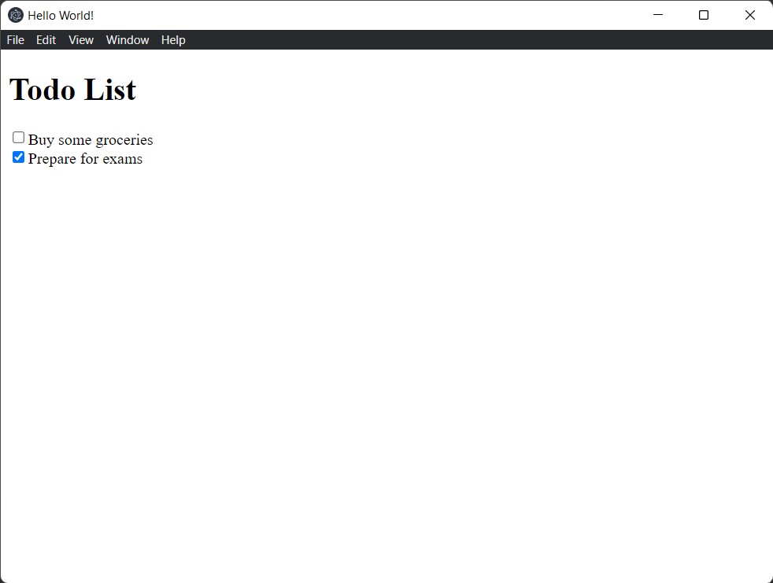

Now that we have electron setup, let us start displaying some todos.

## Modifying index.html

To get started let us modify the html file so that we can start adding todos.

Let us add a title and a div which can store the todos. Replace the body of `index.html` with the following:

```html
<h1>Todo List</h1>
<div id="todos"></div>
```

In electron, the main script file (in our case `main.js`) cannot directly access and modify the html page. To do that, we need to link another script file so that we can modify the html file.

Create a file named `index.js` and add the following to the body of `index.html`:

```html
<script src="index.js"></script>
```

Once you have done this, your `index.html` file should look like this:

```html
<!DOCTYPE html>
<html>
  <head>
    <meta charset="UTF-8">
    <!-- https://developer.mozilla.org/en-US/docs/Web/HTTP/CSP -->
    <meta http-equiv="Content-Security-Policy" content="default-src 'self'; script-src 'self'; img-src 'self' blob: data:;">
    <meta http-equiv="X-Content-Security-Policy" content="default-src 'self'; script-src 'self'; img-src 'self' blob: data:;">
    <title>Hello World!</title>
  </head>
  <body>
    <h1>Todo List</h1>
    <div id="todos"></div>

    <script src="index.js"></script>
  </body>
</html>
```

## Modifying the html file using JavaScript

Now that we have our html file setup, let us dynamically add todos using JavaScript.

First let us create a variable holding a list of todos.
Each todo has a following information:

1. A Description
2. Whether or not it has been completed

Inside `index.js` create a variable named Todos which contains a list of todo objects like this:

```javascript
let Todos = [
  {
    Description: "Buy some groceries",
    Done: false,
  },
  {
    Description: "Prepare for exams",
    Done: true,
  },
];
```

Now let us create a function which adds our todos to the html file.
Each todo is combination of a checkbox and a span. We are giving each checkbox a unique id so that we can identify them later.

```javascript
function displayTodos(todos) {
  // Get the div inside which we are going to store the todos
  todosHTML = document.getElementById("todos");

  // Clear the contents of the div
  todosHTML.innerHTML = "";

  let i = 0;
  todos.forEach((todo) => {
    todosHTML.innerHTML +=
      '<input type="checkbox" id="todo-check-' +
      i +
      '"' +
      (todo.Done ? "checked" : "") +
      "><span>" +
      todo.Description +
      "</span><br/>";
    i++;
  });
}
```

Finally, let us run this function. To do this add the following line in `index.js`:

```javascript
displayTodos(Todos);
```

At this point your `index.js` file should look like this:

```javascript
let Todos = [
  {
    Description: "Buy some groceries",
    Done: false,
  },
  {
    Description: "Prepare for exams",
    Done: true,
  },
];

function displayTodos(todos) {
  // Get the div inside which we are going to store the todos
  todosHTML = document.getElementById("todos");

  // Clear the contents of the div
  todosHTML.innerHTML = "";

  let i = 0;
  todos.forEach((todo) => {
    todosHTML.innerHTML +=
      '<input type="checkbox" id="todo-check-' +
      i +
      '"' +
      (todo.Done ? "checked" : "") +
      "><span>" +
      todo.Description +
      "</span><br/>";
    i++;
  });
}

displayTodos(Todos);
```

If you start your application using the command `npm start` you should see something that looks like this:

